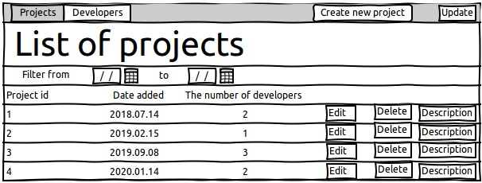
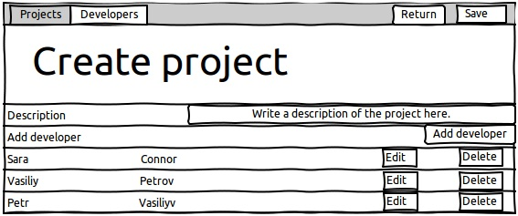
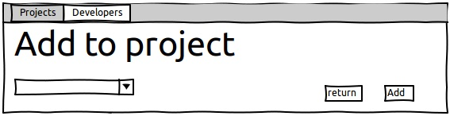
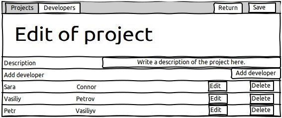
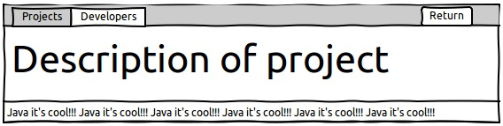
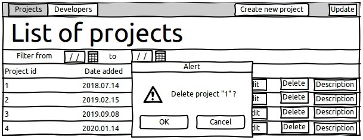
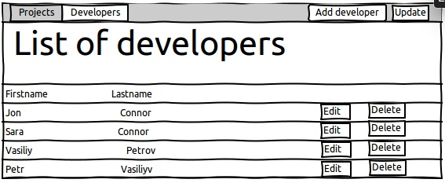
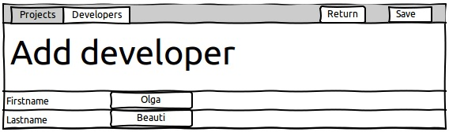
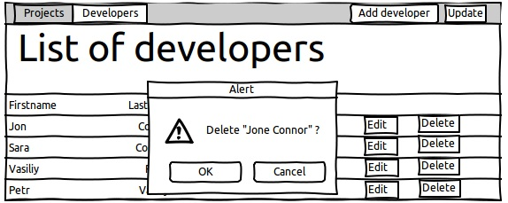

**Development team**

**Vision**

Requires a web application to work with the project.

The application should implement the following functions:

\- view a list of projects;

\- the ability to edit and delete data for each project;

\- ability to add a new project with the appointment of developers participating
in the project;

\- display the number of developers for each project;

\- the ability to give a description of each project;

\- view a list of developers;

\- the ability to edit and delete data for each developer;

**1.Projects**

**1.1.View a list of projects.**

This mode is intended for viewing the list of projects and the number of
developers assigned to each project.

*The main scenario:*

\- the user selects the menu item "Projects".

\- the form for viewing the list of all projects is displayed.

Figure 1.1.1.Project List

There are following columns in the list:

\- Project id;

\- Date of registration of the project;

\- The number of developers participating in the project;

*Filtration:*

\- to view the list of projects, it is possible to filter projects by the date
of their addition;

\- the start date of the filter should not be greater than the end date of the
filter;

\- if data is not entered, then filtering is not performed;

\- if the value of the start date is not entered, then filtering is performed by
the end date;

\- if the end date is not entered, then filtering is performed by the start
date;

\- the default filter is set to display all projects;

\- data is updated after selecting a filter by clicking on the “Update” button.

**1.2.Adding a new project**

*The main scenario:*

\- the user, being in the view mode of the list of projects, presses the “create
new project” button;

\- the window for adding a new project is displayed;

Figure 1.2.1.Window for adding a new project

\- the user fills the line “Description”;

\- the user adds the developers participating in the project by clicking the
“Add developer” button;

\- a window for adding developers participating in the project is displayed;

Figure 1.2.2.Window for adding developers participating in the project

\- by clicking on the “Add” button we add the corresponding

developer to participate in the project;

\- click the “Save” button, after which the project is added to the database;

\- if a project is added, an updated form for viewing all projects opens.

*Scenario to cancel adding a project:*

\- the user, being in the view mode of all projects, clicks on the “create new
project” button;

\- the form for adding a new project is displayed;

\- the user enters data and presses the “return” button;

\- the project is not saved to the database and a window for viewing all
projects is displayed.

**1.3.Project editing**

*The main scenario:*

\- the user, being in the view mode of all projects, clicks on the “Edit”
button;

\- the project editing window opens;

Figure 1.3.1.Project Editing Window

\- the user fills in or adjusts the line “Description”;

\- the user adds or removes the developers participating in the project by
clicking the “Add developer” or “Delete” button;

\- clicking the “Delete” button deletes the corresponding developer to
participate in the project;

\- clicking the “Add developer” button displays a window for adding developers
participating in the project;

Figure 1.3.2.Window for adding developers participating in the project

\- click the “Save” button, after which the project is added to the database;

\- if the project is updated, an updated form for viewing all projects opens.

*Project update cancellation scenario:*

\- the user, being in the view mode of all projects, clicks on the “Edit”
button;

\- the project update form is displayed;

\- the user enters data and presses the “return” button;

\- the project is not updated in the database and a window for viewing all
projects is displayed.

**1.4.View project description**

*The main scenario:*

\- the user, being in the view mode of all projects, clicks on the “Description”
button;

\- the project viewing form is displayed;

Figure 1.4.1.Project viewing form

\- the user presses the “Return” button;

\- a window for viewing all projects is displayed.

**1.5.Delete project**

*The main scenario:*

\- the user, being in the view mode of all projects, clicks on the “Delete”
button;

\-The confirmation dialog for deletion opens;

Figure 1.5.1.Project Delete Confirmation Window

\- the user clicks “OK”;

\- the project is deleted from the database;

\- if the project was successfully deleted, the window for viewing all projects
opens.

*Uninstall cancellation scenario:*

\- the user, being in the view mode of all projects, clicks on the “Delete”
button;

\- a confirmation dialog for deletion opens;

\- the user clicks “Cancel”;

\- the project is not deleted from the database and a window for viewing all
projects opens.

**2.Developers**

**2.1.View a list of developers**

This mode is intended for viewing the list of developers.

*The main scenario:*

\- the user selects the menu item “Developers”;

\- the form for viewing the list of all developers is displayed;

Figure 2.1.1.View a list of developers

There are following columns in the list:

\- “Firstname” - the name of the developer;

\- “Lastname” - the surname of the developer;

**2.2.Adding a developer**

*The main scenario:*

\- the user, being in the view mode of all developers, clicks the “Add
developer" button;

\- the form for adding a user is displayed;

Figure 2.2.1 Developer Add Form

\- the user enters data and clicks the “Save” button;

\- if the data is correct, then the data about the developer is saved in the
database;

\- if an error occurred while saving data, an error message is displayed storing
data;

\- if the data has been successfully added, a display form opens for all
developers with updated data.

*Developer add cancellation scenario:*

\- the user, being in the view mode of all developers, clicks the “Add
developer" button;

\- the form for adding a user is displayed;

\- the user enters data and presses the “Return” button;

\- data is not stored in the database;

\- a display form opens for all developers.

**2.3.Editing developer data**

*The main scenario:*

\- the user, while in the view mode of all developers, presses the “Edit” button
located in the line of the selected developer;

\- the developer editing form is displayed;

\- the user changes the developer’s data and clicks the “Save” button;

\- if the data is entered incorrectly, a warning is displayed about incorrectly
entered data;

\- if the data is entered correctly, then the developer data is saved in the
database and a form for displaying all developers with updated data opens;

*Change cancellation scenario:*

\- the user, while in the view mode of all developers, presses the “Edit” button
located in the line of the selected developer;

\- the editing form is displayed;

\- the user changes the developer’s data and presses the “Return” button;

\- a display form opens for all developers.

**2.4.Deleting developer data**

*The main scenario:*

\- the user, while in the view mode of all developers, presses the “Delete”
button located in the line of the selected developer;

\-The confirmation dialog for deletion opens;

\- the user clicks “OK”;

\- data about the developer is deleted from the database;

\- if the data about the developer is successfully deleted, a window opens for
viewing all developers with updated data.

Figure 2.4.1.Developer data deletion confirmation window

*Uninstall cancellation scenario:*

\- the user, being in the viewing mode of all developers, clicks on the “Delete”
button;

\- a confirmation dialog for deletion opens;

\- the user clicks “Cancel”;

\- data about the developer is not deleted from the database and a window for
viewing all developers opens.
